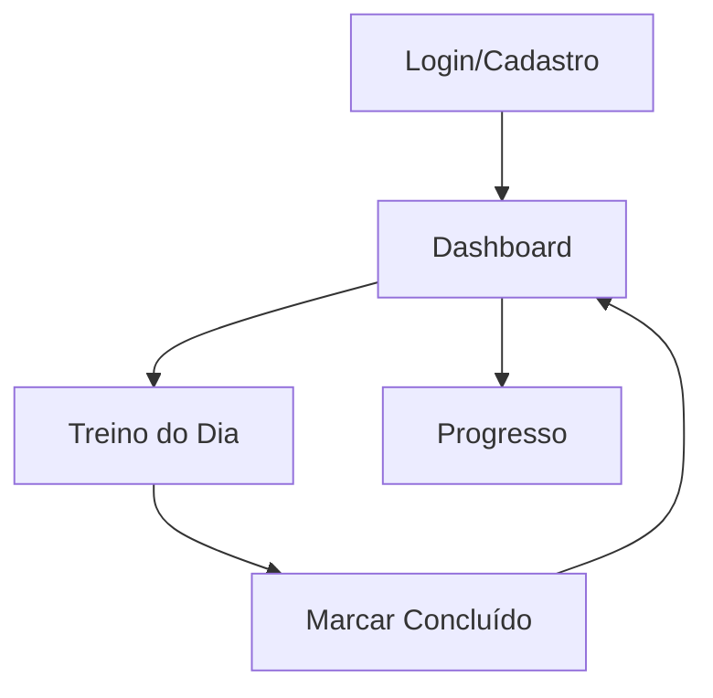

## 1. Product Overview
Plataforma SaaS minimalista para desafio de 20 dias de treino feminino. Ajudar mulheres a completar treinos curtos e estruturados com acompanhamento visual de progresso.

## 2. Core Features

### 2.1 User Roles
| Role | Registration Method | Core Permissions |
|------|---------------------|------------------|
| User | Email registration | Access workouts, track progress, complete challenge |

### 2.2 Feature Module
Nossa plataforma consiste nas seguintes páginas essenciais:
1. **Login/Cadastro**: Autenticação segura via email/senha
2. **Dashboard**: Status do desafio e acesso ao treino do dia
3. **Treino do Dia**: Exercícios, repetições e vídeos embedados
4. **Progresso**: Timeline vertical com status dos 20 dias

### 2.3 Page Details
| Page Name | Module Name | Feature description |
|-----------|-------------|---------------------|
| Login/Cadastro | Formulário de autenticação | Permite login com email/senha e cadastro de novas usuárias |
| Dashboard | Status do desafio | Exibe progresso atual (ex: "Dia 5/20") e botão para treino do dia |
| Treino do Dia | Visualização do treino | Mostra exercícios, repetições, vídeos embedados e botão "Concluir Treino" |
| Progresso | Timeline de progresso | Lista vertical dos 20 dias com status visual (concluído ✓, dia atual ->, pendente ⚪) |

## 3. Core Process
Usuária acessa → Realiza cadastro/login → Visualiza dashboard com status → Acessa treino do dia → Marca como concluído → Visualiza progresso atualizado

## 4. User Interface Design

### 4.1 Design Style
- Cores: Paleta pastel com púrpura como primária, branco/cinza claro como base
- Tipografia: Moderna e legível, fontes sans-serif
- Botões: Estilo arredondado, minimalista
- Layout: Mobile-first, cards limpos e espaçados
- Ícones: Elegantes e discretos (✓, ->, ⚪)

### 4.2 Page Design Overview
| Page Name | Module Name | UI Elements |
|-----------|-------------|-------------|
| Dashboard | Status do desafio | Card central com contador "X/20 dias", botão grande "Iniciar Treino" em púrpura |
| Treino do Dia | Lista de exercícios | Cards empilhados com nome do exercício, repetições, vídeo embedado, botão "Concluir Treino" fixo na base |
| Progresso | Timeline vertical | Lista scrollável com dias numerados, ícones de status à direita, contador no topo |

### 4.3 Responsiveness
Mobile-first obrigatório, adaptação automática para desktop