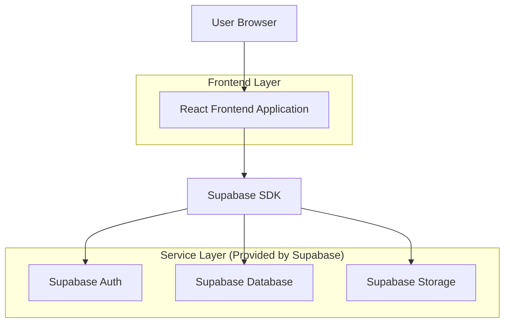
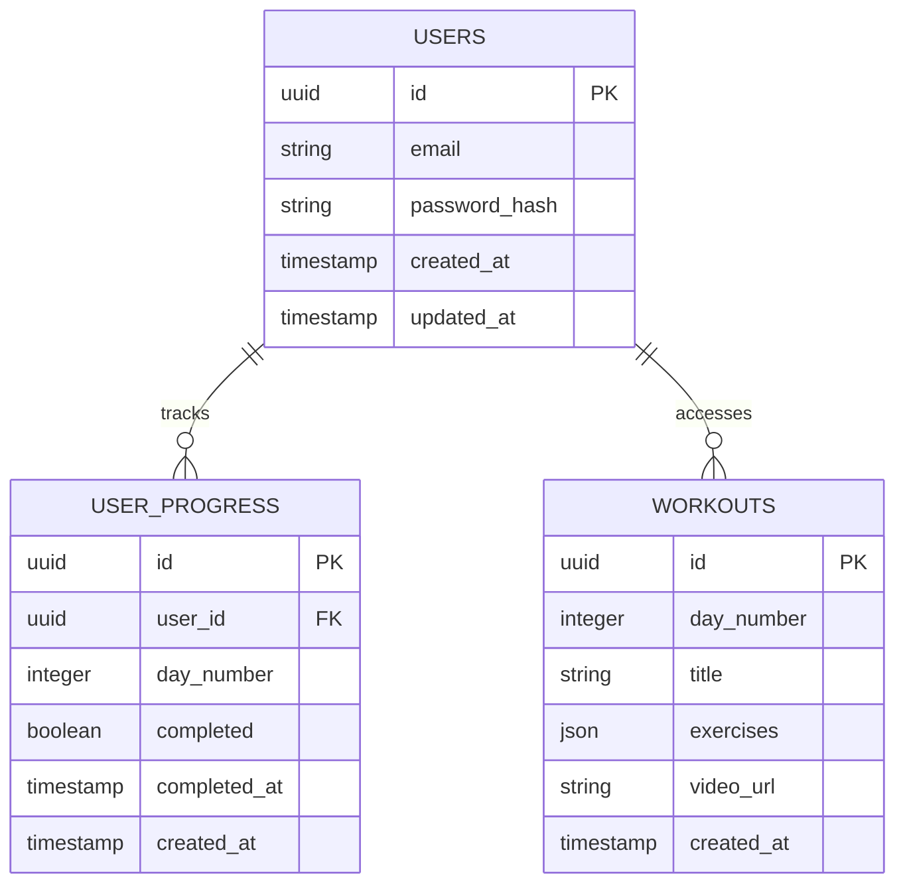

## 1.Architecture design



## 2.Technology Description
- Frontend: React@18 + tailwindcss@3 + vite
- Initialization Tool: vite-init
- Backend: Supabase (Auth + Database + Storage)

## 3.Route definitions
| Route | Purpose |
|-------|---------|
| /login | Login page, user authentication |
| /register | Registration page, new user signup |
| /dashboard | Main dashboard, shows challenge progress |
| /workout/:day | Workout page for specific day |
| /progress | Progress timeline page |

## 4.API definitions

### 4.1 Core API

User authentication via Supabase Auth
```
POST /auth/v1/token
POST /auth/v1/signup
```

Workout progress tracking
```
GET /rest/v1/workouts?user_id=eq.{userId}
POST /rest/v1/user_progress
PATCH /rest/v1/user_progress?id=eq.{progressId}
```

## 5.Server architecture diagram
Não aplicável - Arquitetura serverless com Supabase

## 6.Data model

### 6.1 Data model definition


### 6.2 Data Definition Language

Users Table (users)
```sql
-- create table
CREATE TABLE users (
    id UUID PRIMARY KEY DEFAULT gen_random_uuid(),
    email VARCHAR(255) UNIQUE NOT NULL,
    password_hash VARCHAR(255) NOT NULL,
    created_at TIMESTAMP WITH TIME ZONE DEFAULT NOW(),
    updated_at TIMESTAMP WITH TIME ZONE DEFAULT NOW()
);

-- grant permissions
GRANT SELECT ON users TO anon;
GRANT ALL PRIVILEGES ON users TO authenticated;
```

User Progress Table (user_progress)
```sql
-- create table
CREATE TABLE user_progress (
    id UUID PRIMARY KEY DEFAULT gen_random_uuid(),
    user_id UUID REFERENCES users(id) ON DELETE CASCADE,
    day_number INTEGER NOT NULL CHECK (day_number >= 1 AND day_number <= 20),
    completed BOOLEAN DEFAULT false,
    completed_at TIMESTAMP WITH TIME ZONE,
    created_at TIMESTAMP WITH TIME ZONE DEFAULT NOW(),
    UNIQUE(user_id, day_number)
);

-- grant permissions
GRANT SELECT ON user_progress TO anon;
GRANT ALL PRIVILEGES ON user_progress TO authenticated;

-- create indexes
CREATE INDEX idx_user_progress_user_id ON user_progress(user_id);
CREATE INDEX idx_user_progress_day ON user_progress(day_number);
```

Workouts Table (workouts)
```sql
-- create table
CREATE TABLE workouts (
    id UUID PRIMARY KEY DEFAULT gen_random_uuid(),
    day_number INTEGER UNIQUE NOT NULL CHECK (day_number >= 1 AND day_number <= 20),
    title VARCHAR(255) NOT NULL,
    exercises JSONB NOT NULL,
    video_url TEXT,
    created_at TIMESTAMP WITH TIME ZONE DEFAULT NOW()
);

-- grant permissions
GRANT SELECT ON workouts TO anon;
GRANT SELECT ON workouts TO authenticated;

-- insert initial workouts data
INSERT INTO workouts (day_number, title, exercises, video_url) VALUES
(1, 'Treino Dia 1 - Iniciando Forte', '[{"exercise": "Polichinelos", "reps": "30 seg"}, {"exercise": "Agachamento", "reps": "15 rep"}]', 'https://youtube.com/embed/day1'),
(2, 'Treino Dia 2 - Resistência', '[{"exercise": "Prancha", "reps": "30 seg"}, {"exercise": "Afundo", "reps": "12 rep cada"}]', 'https://youtube.com/embed/day2');
```